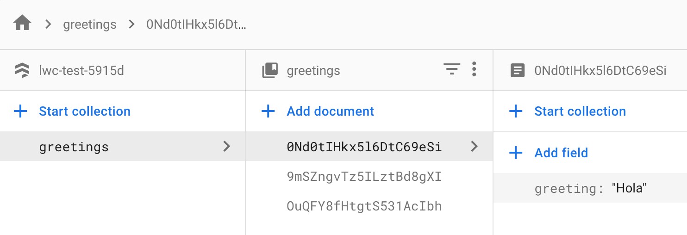

# Lightning Web Components OSS with Google Firestore

A simple web app to test Lightning Web Components (Open Source) and retrieve a list of greetings from Google Firestore.

## How to start?

Start simple by running `yarn watch` (or `npm run watch`, if you set up the project with `npm`). This will start the project with a local development server.

The source files are located in the [`src`](./src) folder. All web components are within the [`src/modules`](./src/modules) folder. The folder hierarchy also represents the naming structure of the web components.

Find more information on the main repo on [GitHub](https://github.com/muenzpraeger/create-lwc-app).

## How was this project created?

1. npx create-lwc-app lwc-test
2. cd lwc-test
3. npm install
4. npm install --save firebase
5. firebase init

Then take a look at what I've added to `src`:
* `src/firebase.js`
* `models/greeting.js`
* `modules/my/greeting/greeting.js`

From the [firebase console](https://console.firebase.google.com), add some greeting records to your database:

